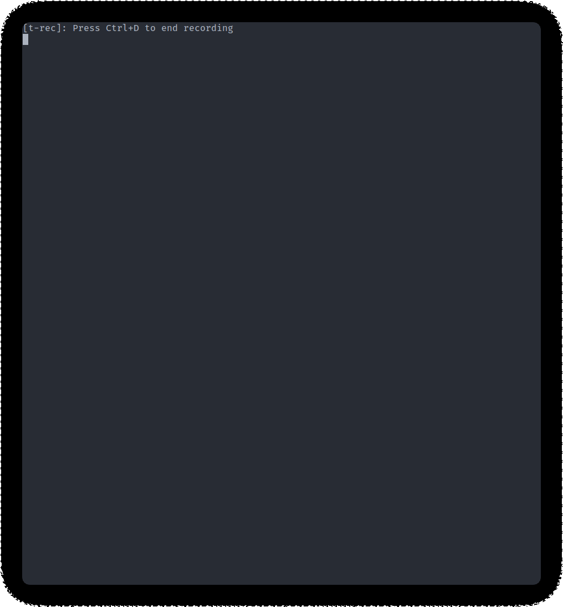

# fdsbml

Please don't use.



## How to use

I use this to integrate SBML parsing with [telescope](https://github.com/nvim-telescope/telescope.nvim) in [neovim](https://github.com/neovim/neovim).

Install it with

```shell
git clone https://github.com/carrascomj/fdsbml.git
cargo install --path .
```

Put this somewhere in your neovim configuration:

```lua
-- utility function
local function insert_line_with(line, prompt_bufnr, mode)
	mode = mode or "o"
	vim.api.nvim_set_var("matched", line)
	print(line)
	actions.close(prompt_bufnr)
	vim.cmd([[exe "normal! ]] .. mode .. [[" . matched]])
end

-- show a fuzzy summary of a SBML file at root_dir .. @"
-- The SBML file is taken from register @ and then looked up in the working dir
local fsbml = function()
	local model_file
	require('plenary.job'):new({
		command = "fd",
		args = {"-F", "-p", vim.fn.getreg("@")},
		on_exit= function(j, _)
			model_file = j:result()[1]
		end
	}):sync()
	-- Show on the status the file that we took
	print(model_file)
	require('telescope.pickers').new {
		results_title = 'SBML summary',
		prompt_prefix = " ",
		finder = require('telescope.finders').new_oneshot_job(
			{ 'fdsbml', model_file }
		),
		sorter = require('telescope.sorters').get_fzy_sorter(),
		attach_mappings = function(prompt_bufnr, map)
			-- On enter, insert cobrapy-like accession on the next line
			map('i', '<CR>', function(bufnr)
				local content = require('telescope.actions.state').get_selected_entry(bufnr)
				local match = content.value:match([[ ([a-zA-Z0-9_-]+): ]])
				if (content.value:match([[Reaction]])) then
					match = [[model.reactions.get_by_id("]] .. match:sub(3) .. [[")]]
					elseif (match:match("prot_")) then
					match = [[model.proteins.get_by_id("]] .. match:sub(3) .. [[")]]
					elseif (match:match("^M_")) then
					match = [[model.metabolites.get_by_id("]] .. match:sub(3) .. [[")]]
				end
				insert_line_with(match, prompt_bufnr)
			end)
			-- On Ctrl-i, insert just the identifier
			map('i', '<C-i>', function(bufnr)
				local content = require('telescope.actions.state').get_selected_entry(bufnr)
				local match = content.value:match([[ ([a-zA-Z0-9_-]+): ]])
				insert_line_with(match:sub(3), prompt_bufnr, "a")
			end)
			return true
		end
	}:find()
end

-- and some arbitrary keymap!
vim.cmd[[
  noremap <C-q> :lua fdsbml()<CR>
]]
```
